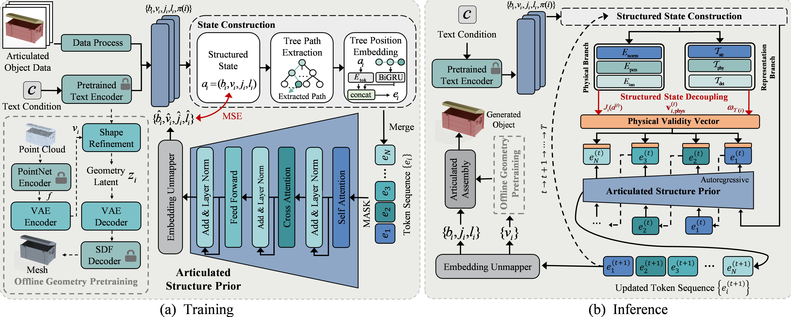
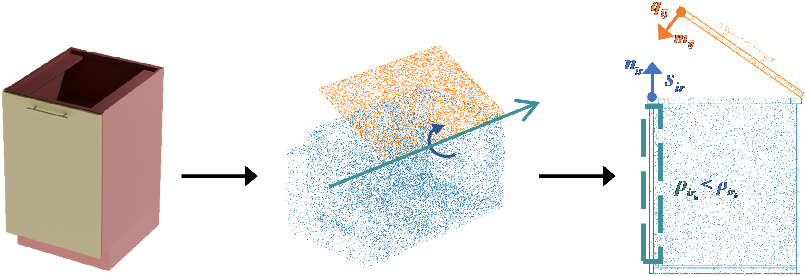
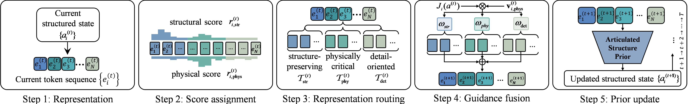
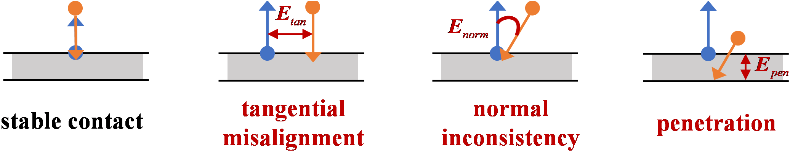
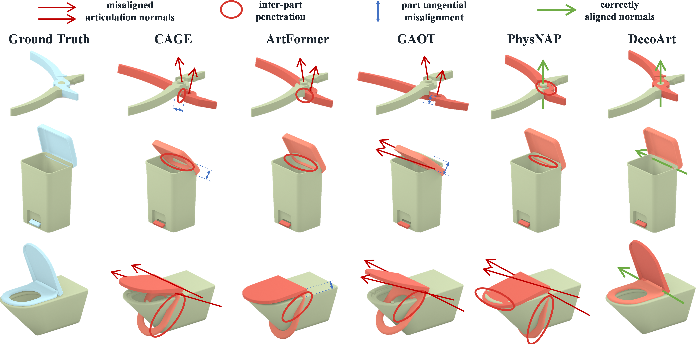
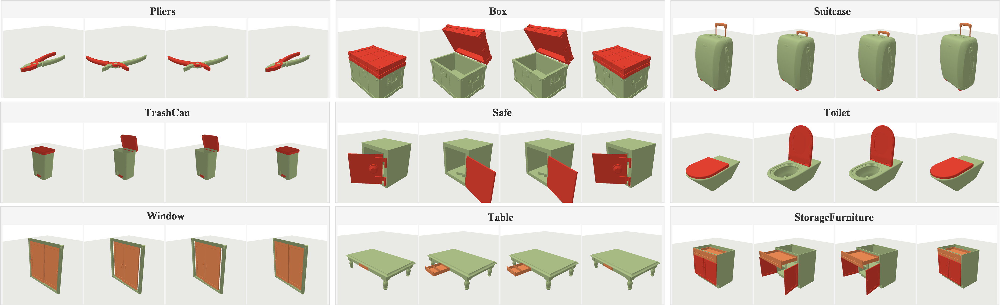

# DecoArt: Structured State Decoupling for Physically Valid Articulated Object Generation

**NeurIPS 2026**

DecoArt is an autoregressive structured state decoupling framework that separates physical evaluation from representation routing, enabling inference-time contact-consistency control without retraining the generator. It generates physically valid articulated 3D objects from text descriptions, with explicit guarantees for tangential alignment, normal consistency, and non-penetration.



## TL;DR

Existing articulated object generators embed physical knowledge only at training time. DecoArt decouples the articulated structured state into a **Physical Evaluation Branch** (tangential alignment, normal consistency, non-penetration) and a **Representation Routing Branch** (deciding which part representations receive stronger physical evaluation). During inference, both branches fuse through a physical validity vector injected into the articulated structure prior — improving physical validity without retraining.

## Method

### 1. Articulated Structure Prior

DecoArt builds a text-conditioned articulated structure prior as the generative backbone. Each articulated object is represented as a rooted tree $\tau=(\mathcal{V},\mathcal{E})$, where each node stores:

| Attribute | Dim | Description |
|-----------|-----|-------------|
| $b_i$ | $\mathbb{R}^6$ | Bounding box (center + size) |
| $v_i$ | $\mathbb{R}^{768}$ | Geometry latent code |
| $j_i = (o_i, d_i)$ | $\mathbb{R}^6$ | Joint origin + axis direction |
| $l_i$ | $\mathbb{R}^4$ | Motion limits (slide min/max, rotate min/max) |
| $\pi(i)$ | index | Parent node index |

A BiGRU encodes the root-to-node path as tree-aware positional embedding. A transformer decoder with cross-attention to T5-large text features predicts part attributes autoregressively.



### 2. Structured State Decoupling

**Physical Evaluation Branch** derives physically interpretable quantities from the structured state:
- **Contact face selection**: face with maximal alignment to motion direction
- **Support face selection**: parent/nearby face best opposing the contact normal
- **Clearance margin** $\delta_i$: adaptive safety margin from motion limits

**Representation Routing Branch** partitions tokens into three groups based on structural and physical scores:

$$r_{i,\mathrm{str}} = \lambda_d\left(1-\frac{\mathrm{depth}(i)}{d_{\max}}\right)+\lambda_s\frac{|\mathcal{V}_i|}{N}, \quad r_{i,\mathrm{phys}} = \lambda_{\Delta}\Delta_i+\lambda_{\Omega}\Omega_i$$

Tokens are assigned to $\mathcal{T}_{\mathrm{str}}$ (structure-preserving), $\mathcal{T}_{\mathrm{phy}}$ (physically critical), or $\mathcal{T}_{\mathrm{det}}$ (detail-oriented).



### 3. Inference-time Physical Evaluation

Physical validity cost computed on the structured state (not decoded meshes):

$$E_{\text{tan}} = \|(I - nn^\top)(\hat q - s)\|_2, \quad E_{\text{norm}} = 1 + n^\top \hat m, \quad E_{\text{pen}} = -n^\top(\hat q - s) - \delta_i$$

$$J_i(a) = -\mathrm{Avg}\left[\rho \cdot \exp\!\left(-\frac{E_{\text{tan}}+\alpha E_{\text{norm}}}{d_{\max}}\right)\right] + \beta \cdot \mathrm{Avg}\left[\mathrm{softplus}\!\left(\frac{E_{\text{pen}}}{\tau_{\mathrm{pen}}}\right)\right]$$

The physical validity vector is injected into token representations with routing-group-specific strength:

$$e_i^{(t+1)} = e_i^{(t)} + \eta_t \cdot \omega_{\mathcal{T}(i)} \cdot \sigma(J_i(a^{(t)})) \cdot \frac{\mathbf{v}_{i,\mathrm{phys}}^{(t)}}{\|\mathbf{v}_{i,\mathrm{phys}}^{(t)}\|_2+\epsilon}$$



## Main Results

### In-Domain Generation (PartNet-Mobility + PM-Openable)

| Method | PV-Rate $\uparrow$ | Align $\downarrow$ | Cons. $\downarrow$ | No-Pen $\downarrow$ | CD $\downarrow$ | Axis Err $\downarrow$ |
|--------|:---:|:---:|:---:|:---:|:---:|:---:|
| CAGE | 51.3 | 0.157 | 0.285 | 0.081 | 0.028 | 16.4 |
| ArtFormer | 62.1 | 0.103 | 0.214 | 0.052 | 0.024 | 12.1 |
| GAOT | 59.4 | 0.116 | 0.231 | 0.061 | **0.022** | 12.8 |
| PhysNAP | 64.8 | 0.096 | 0.203 | 0.049 | 0.025 | 13.5 |
| **DecoArt** | **75.0** | **0.071** | **0.156** | **0.028** | 0.023 | **11.6** |

**PV-Rate by articulation depth:** DecoArt achieves consistent gains across all depths, with the largest improvement on complex hierarchies ($\mathcal{D}_{d\geq5}$: 64.0 vs. 51.7 for PhysNAP).

### Cross-Dataset Generalization (ACD, zero-shot)

| Method | PV-Rate $\uparrow$ | Align $\downarrow$ | Cons. $\downarrow$ | No-Pen $\downarrow$ |
|--------|:---:|:---:|:---:|:---:|
| PhysNAP | 52.6 | 0.151 | 0.274 | 0.079 |
| **DecoArt** | **64.1** | **0.104** | **0.211** | **0.046** |

### Dynamic Validation (PyBullet Simulation)

| CAGE | ArtFormer | GAOT | PhysNAP | **DecoArt** |
|:---:|:---:|:---:|:---:|:---:|
| 46.3 | 57.3 | 55.6 | 66.7 | **77.2** |

Dyn-SR measures the percentage of objects completing a closed→open→closed trajectory with zero self-contact and strict joint tracking tolerances ($5^\circ$ revolute, $0.03$ prismatic).

### Ablation Study

| Variant | PV-Rate $\uparrow$ | Align $\downarrow$ | Cons. $\downarrow$ | No-Pen $\downarrow$ |
|---------|:---:|:---:|:---:|:---:|
| Full DecoArt | **75.0** | **0.071** | **0.156** | **0.028** |
| w/o PEB | 62.1 | 0.118 | 0.239 | 0.064 |
| w/o RRB | 68.5 | 0.094 | 0.196 | 0.046 |
| w/o $E_{\text{tan}}$ | 67.2 | 0.132 | 0.162 | 0.032 |
| w/o $E_{\text{norm}}$ | 68.1 | 0.075 | 0.248 | 0.030 |
| w/o $E_{\text{pen}}$ | 65.7 | 0.076 | 0.160 | 0.071 |



## Simulation Videos

DecoArt generated objects are validated in PyBullet with closed→open→closed actuation trajectories. Each object must maintain joint tracking tolerance, zero self-contact, and floor stability throughout the full motion cycle.



Simulation videos are generated using Blender-rendered frame sequences. The rendering pipeline is controlled by `simple_gif_generator.py` and the Blender templates in `static/`.

## Project Structure

```
ArtGen/
├── 1_train_SDF.py              # Stage 1: SDF auto-encoder training
├── 2_train_diff.py             # Stage 2: Latent diffusion training
├── 3_train_trans.py            # Stage 3: Articulation transformer training
├── 3_pred_trans.py             # Inference: generate articulated objects
├── demo.py                     # Interactive demo with text prompts
├── configs/
│   ├── 1_SDF/                  # SDF model configs
│   ├── 2_Diff/                 # Diffusion model configs
│   └── 3_TF-Diff/              # Transformer + diffusion configs (text & image)
├── model/
│   ├── SDFAutoEncoder/         # PointNet encoder + SDF decoder + VAE
│   ├── Diffusion/              # Conditional latent diffusion for geometry
│   └── Transformer/            # Articulation transformer with DecoArt extensions
│       ├── transformer/
│       │   ├── decoder.py      # Main TransformerDecoder
│       │   └── layers/
│       │       ├── position.py       # BiGRU tree-aware position embedding
│       │       ├── decoder_layer.py  # Self/cross-attention with FastVGGT
│       │       ├── token.py          # MLP tokenizer/untokenizer
│       │       └── layernorm_gru.py  # LayerNorm GRU cell
│       ├── dataloader/         # Transformer dataset
│       └── eval/               # Inference evaluator
├── experiments/
│   └── decoart/                # DecoArt evaluation suite
│       ├── state_metrics.py          # Physical evaluation + representation routing
│       ├── build_state_metadata.py   # Batch metric computation
│       └── compare_state_metrics.py  # Guidance vs. no-guidance comparison
├── data/
│   └── process_data_script/    # Dataset preprocessing pipeline (6 stages)
├── eval/                       # Visualization and evaluation utilities
├── utils/                      # Mesh generation, Blender drivers, logging
├── static/                     # Blender render templates and background assets
├── docs/decoart/               # Paper figures and diagrams
└── env.yaml                    # Conda environment specification
```

### Key DecoArt-specific Code

The physical evaluation and representation routing logic from the paper lives in `experiments/decoart/state_metrics.py`:

- **`_physical_terms_for_part()`** — Computes $E_{\text{tan}}$, $E_{\text{norm}}$, $E_{\text{pen}}$, and $J_i$ from structured state (box + joint + limit)
- **`_route_representations()`** — Assigns each part token to structure/physics/detail groups using $r_{i,\mathrm{str}}$ and $r_{i,\mathrm{phys}}$
- **`analyze_parts()`** — Full analysis pipeline: tree parsing → physical terms → routing → PV-Rate summary

The inference-time physical guidance in `model/Transformer/eval/__init__.py`:

- **`_build_physics_guidance_context()`** — Constructs scene proxy from parent boxes
- **`_physics_guidance_cost()`** — Computes surface-aware contact cost during latent diffusion denoising
- **`inference_from_text()`** — Full autoregressive pipeline with validity vector injection

The decoder layer (`model/Transformer/transformer/layers/decoder_layer.py`) implements FastVGGT-style anchor/salient token refresh for training stability, which is the architectural foundation for the representation routing in DecoArt.

## Quick Start

### Environment

```bash
conda env create -f env.yaml
conda activate artformer

# Compile C extensions for mesh extraction
cd utils/z_to_mesh/utils/libmcubes
python setup.py build_ext --inplace
cd ../libmise && python setup.py build_ext --inplace
cd ../libsimplify && python setup.py build_ext --inplace
cd ../../../..

# Login to wandb (for training logging)
wandb login
```

### Download Blender (for rendering)

```bash
mkdir -p 3rd && cd 3rd
wget https://ftp.halifax.rwth-aachen.de/blender/release/Blender4.2/blender-4.2.2-linux-x64.tar.xz
tar -xvf blender-4.2.2-linux-x64.tar.xz
cd ..
```

## Training Pipeline

### Stage 1: SDF Auto-Encoder

```bash
# Preprocess raw PartNet-Mobility
cd data/process_data_script
python 1_extract_from_raw_dataset.py
python 2.1_generate_gensdf_dataset.py --n_process 20
cd ../..

# Train SDF model
python 1_train_SDF.py -c configs/1_SDF/train.yaml
```

### Stage 2: Latent Diffusion

```bash
# Generate diffusion dataset (using SDF checkpoint)
cd data/process_data_script
python 2.2_generate_diff_dataset.py --sdf_ckpt_path path/to/SDF/checkpoint
cd ../..

# Train diffusion model
python 2_train_diff.py -c configs/2_Diff/train.yaml
```

### Stage 3: Articulation Transformer

```bash
# Generate text conditions
cd data/process_data_script
python 3.0_generate_text_used_image.py      # Render object images via Blender
python 3.1_generate_text_condition.py       # Generate text descriptions (or use provided)
python 3.2_generate_encoded_text_condition.py  # Encode with T5
python 5_generate_text_transformer_dataset.py --diff_ckpt_path path/to/diffusion/checkpoint
cd ../..

# Train the articulation transformer
python 3_train_trans.py -c configs/3_TF-Diff/text-train.yaml
```

## Evaluation

### Generate Objects

Set the transformer checkpoint path in `configs/3_TF-Diff/text-eval.yaml`, then:

```bash
python 3_pred_trans.py -c configs/3_TF-Diff/text-eval.yaml
```

### Compute DecoArt Metrics

Compute physical/routing metrics on generated outputs:

```bash
# On training data (ground truth reference)
python experiments/decoart/build_state_metadata.py \
  --input data/datasets/4_transformer_dataset \
  --pattern "*.json" \
  --output-dir experiments/decoart/outputs/train_state

# On generated samples
python experiments/decoart/build_state_metadata.py \
  --input elog/final_output/ours_Table \
  --pattern "output.dat" \
  --output-dir experiments/decoart/outputs/ours_table
```

### Compare Guidance vs. No-Guidance

```bash
python experiments/decoart/compare_state_metrics.py \
  --baseline experiments/decoart/outputs/no_guidance/decoart_state_metrics.jsonl \
  --ours experiments/decoart/outputs/guidance/decoart_state_metrics.jsonl \
  --output experiments/decoart/outputs/guidance_delta.json
```

This produces PV-Rate, Align, Cons. (normal consistency), No-Pen, and $J_i$ cost deltas.

### Metrics Summary

| Metric | Description | Output File |
|--------|-------------|-------------|
| `decoart_state_metrics.jsonl` | Per-object PV-Rate, physical terms, routing | JSONL |
| `decoart_part_metrics.csv` | Per-part breakdown with structure/physical scores | CSV |
| `decoart_summary.json` | Aggregated stats + depth-group PV-Rate | JSON |

## Physics Guidance Configuration

Enable inference-time physical guidance in `configs/3_TF-Diff/text-eval.yaml`:

```yaml
physics_guidance_inference:
  enabled: true
  weight_gamma: 0.1        # Guidance strength
  interval_n: 2            # Apply every N denoising steps
  dmax: 0.10               # Contact distance scale
  surface_samples: 256     # Surface query points per part
  topk_neighbors: 16       # Nearest support neighbors
  surface_temperature: 0.05
  normal_weight: 0.0       # Set >0 for normal alignment term
  log_cost: true           # Log J_i before/after guidance
```

Physical evaluation thresholds (for PV-Rate) and routing hyperparameters are configured in `experiments/decoart/state_metrics.py` via `DecoArtMetricConfig`.

## Inference Cost

| Method | Params (M) | Memory (GB) | Time (s/obj.) |
|--------|:---:|:---:|:---:|
| GAOT | 137.6 | 13.1 | 58.7 |
| PhysNAP | 73.2 | 16.2 | 93.5 |
| **DecoArt** | 192.1 | 14.6 | **20.9** |

DecoArt is **2.8× faster** than GAOT and **4.5× faster** than PhysNAP while achieving better physical validity. The breakdown: condition encoding (0.4s) + prior/diffusion (5.8s) + physical evaluation (1.9s) + mesh decode (12.8s).

## Citation

```bibtex
@inproceedings{decoart2026,
  title     = {DecoArt: Structured State Decoupling for Physically Valid
               Articulated Object Generation},
  author    = {Anonymous},
  booktitle = {Advances in Neural Information Processing Systems (NeurIPS)},
  year      = {2026},
}
```

## License

This project is released for research purposes. PartNet-Mobility and PM-Openable datasets require separate access from their original sources.

## Related Works

- **CAGE**: [Controllable Articulation Generation](https://github.com/liutianjiu/CAGE) — CVPR 2024
- **ArtFormer**: [Articulated Object Generation with Transformers](https://github.com/artformer/ArtFormer) — 2025
- **PhysNAP**: [Physics-guided Neural Articulated Parts](https://github.com/raresdk/PhysNAP) — 2025
- **PhysX-3D**: [Physics-grounded 3D Generation](https://github.com/physx3d/PhysX-3D) — 2025
- **Nadeau et al.**: [Generating Stable Placements via Physics-guided Diffusion Models](https://arxiv.org/abs/2501.00000) — 2025
