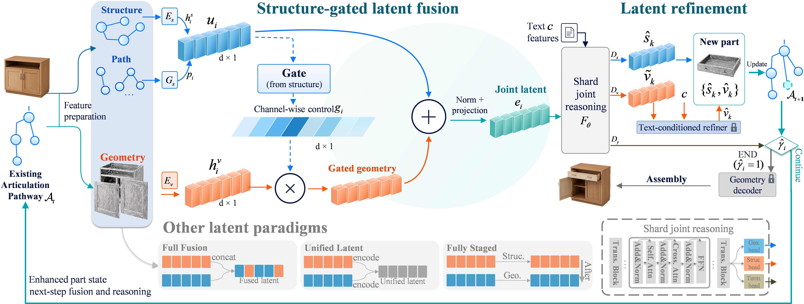
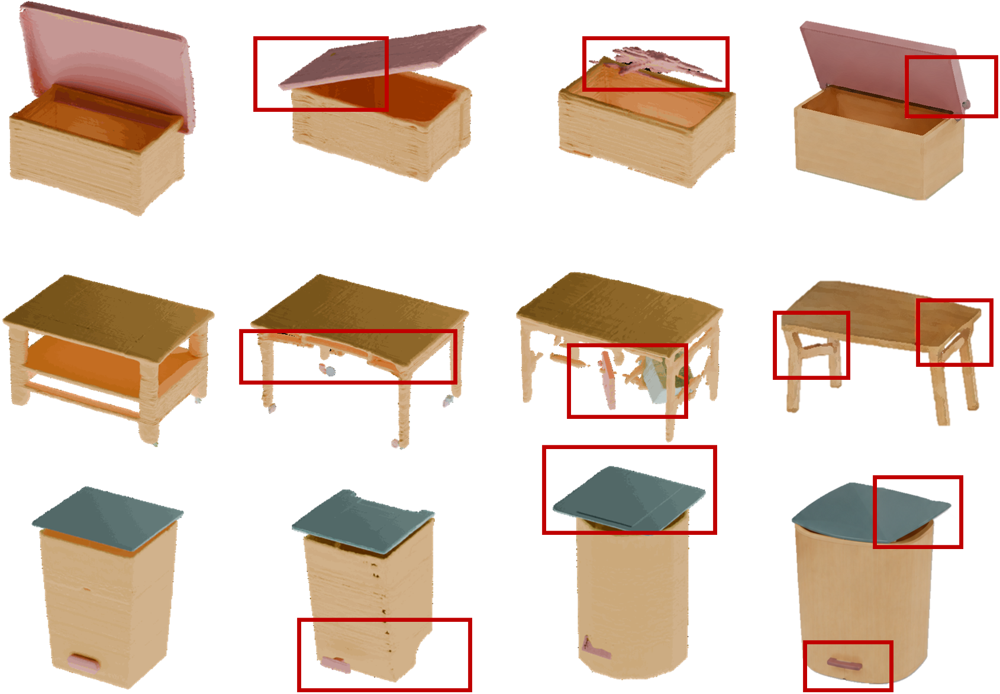
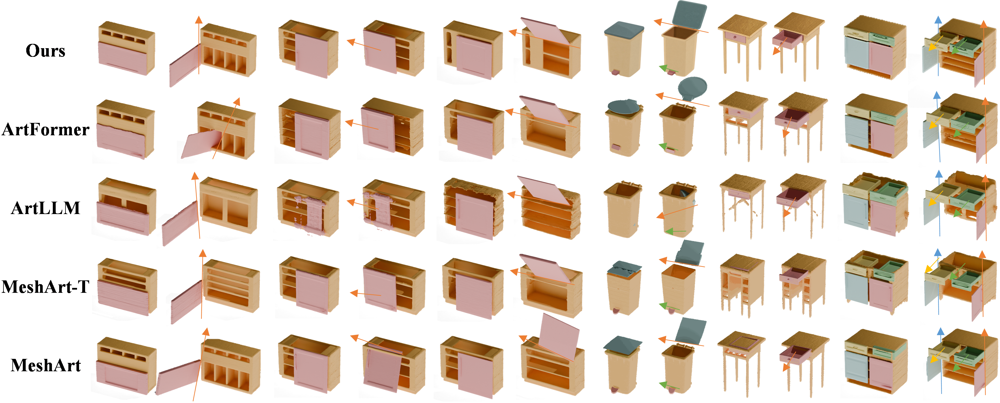

# ARTUS: Articulated Joint Latents under Structural Control for Object Generation

ICLR 2027 (Anonymous Submission)

ARTUS is a joint latent model for articulated object generation that resolves the tension between kinematic structure and dense geometry through **structure-controlled joint latent refinement**: kinematic structure governs how geometric information enters the joint latent, and the geometry realized during generation is fed back to enrich the articulation pathway for subsequent predictions.



## TL;DR

A joint latent representation lets kinematic structure and part geometry interact, but leaves the direction and timing of their interaction unspecified. Mixing geometry in too early lets surface variation rewrite the features that encode articulation structure; excluding geometry entirely prevents realized parts from informing later decisions. ARTUS constructs an **articulation path** summarizing the root-to-part kinematic relations and uses it to **gate geometric features** before joint reasoning. A frozen text-conditioned diffusion prior then **refines the predicted coarse geometry latent**, and the refined latent is fed back into the **Existing Articulation Pathway**, so every later prediction conditions on the geometry actually realized so far.

## Method

### 1. Node State and the Existing Articulation Pathway

Each articulated object is a rooted tree $\tau=(\mathcal{V},\mathcal{E})$. The state of part $i$ factors into explicit kinematic structure and a dense geometry code:

$$a_i=(s_i,v_i),\qquad s_i=[b_i,o_i,d_i,l_i]$$

| Attribute | Dim | Description |
|-----------|-----|-------------|
| $b_i$ | $\mathbb{R}^6$ | Part bounding box (center + extent) |
| $o_i, d_i$ | $\mathbb{R}^3$ each | Joint line (origin + direction) |
| $l_i$ | $\mathbb{R}^4$ | Motion limits (translation + rotation intervals) |
| $v_i$ | $\mathbb{R}^{768}$ | Geometry latent (posterior mean of a frozen part-geometry autoencoder) |
| $\pi(i)$ | index | Parent node index |

The **Existing Articulation Pathway** $\mathcal{A}_t$ stores the structural states, parent assignments and realized geometry latents of all previously generated parts. At each step, the joint-latent context model $F_\theta$ and the factor-specific heads $D_\theta=(D_\gamma,D_s,D_v)$ predict the termination decision, the articulated state and the coarse geometry latent of a new child:

$$(\hat{\gamma}_i,\hat{s}_k,\tilde{v}_k) = D_\theta\!\left(F_\theta(\mathcal{A}_t,c)_i\right), \quad \pi(k)=i$$

### 2. Structure-Gated Latent Fusion

Geometry may affect the joint representation only after the articulation feature is established. Structural states and geometry latents are encoded by factor-specific encoders $E_s$ / $E_v$; a bidirectional GRU $G_s$ aggregates the structural features along the root-to-part path $\mathrm{path}_{\pi}(i) = (r,\ldots,\pi(i),i)$:

$$h_i^s = E_s(s_i),\quad h_i^v = E_v(v_i),\quad p_i = G_s\!\left((h_j^s)_{j \in \mathrm{path}_{\pi}(i)}\right),\quad u_i = h_i^s + p_i$$

A channel-wise gate conditioned solely on the structural representation $u_i$ modulates the geometric channels before fusion:

$$g_i=\sigma(W_g u_i+b_g),\quad \bar h_i^v=g_i\odot h_i^v,\quad e_i=W_f\,\mathrm{LN}\!\left(u_i+\bar h_i^v\right)+b_f$$

Because the gate satisfies $0 < g_i < 1$ element-wise and is independent of geometry, the fusion contracts geometric perturbations, $\lVert\Delta_v r_i\rVert_2 \leq \lVert g_i\rVert_\infty \lVert\Delta h_i^v\rVert_2$, while structural changes pass through an identity path: structure controls the sensitivity of the joint latent to geometric variation.



*Structure-gated fusion (left) compared with fully staged generation (middle) and full fusion (right).*

### 3. Articulation-Pathway-Enhanced Latent Refinement

The coarse geometry code $\tilde{v}_k$ predicted by $D_v$ is refined by a **frozen text-conditioned diffusion prior** $R_\phi$. Instead of restarting from pure Gaussian noise, the coarse prediction is perturbed only to an intermediate diffusion step $\rho^\ast$:

$$z_{\rho^\ast} = \sqrt{\bar{\alpha}_{\rho^\ast}}\,\tilde v_k + \sqrt{1-\bar{\alpha}_{\rho^\ast}}\,\epsilon, \qquad \epsilon\sim\mathcal N(0,I)$$

and the prior runs the reverse process from $\rho^\ast$ back to $0$, yielding the enhanced latent $\hat{v}_k = z_0$. A smaller $\rho^\ast$ preserves more of the coarse prediction; a larger $\rho^\ast$ gives the prior more freedom to correct it.

Crucially, refinement is **not** terminal post-processing: the enhanced latent is returned to the autoregressive state,

$$\mathcal A_{t+1} = \mathcal A_t \cup \{(\hat{s}_k,\hat{v}_k,\pi(k))\},$$

so subsequent joint reasoning conditions on the geometry realized in preceding steps. This recurrent loop $\mathcal A_t \rightarrow \hat v_k \rightarrow \mathcal A_{t+1}$ constitutes articulation-pathway-enhanced latent refinement.

### 4. Structure-Controlled Joint-Latent Objective

The geometry autoencoder and the text-conditioned refiner are pretrained and frozen; the joint-latent model is trained with teacher forcing under

$$\mathcal L = \mathcal L_{\mathrm{end}} + \alpha\,\mathcal L_{\mathrm{state}} + \beta\,\mathcal L_{\mathrm{geo}} + \lambda\,\mathcal L_{\mathrm{scl}},\qquad (\alpha,\beta,\lambda)=(1,\,0.5,\,0.1)$$

where $\mathcal L_{\mathrm{end}}$ is binary cross-entropy on termination, $\mathcal L_{\mathrm{state}}$ / $\mathcal L_{\mathrm{geo}}$ are channel-normalized regression losses, and $\mathcal L_{\mathrm{scl}}$ directly regularizes the structure-controlled joint representation: with $\hat r_k = \hat u_k + \hat g_k \odot E_v(\tilde v_k)$ built from the *predicted* child state and $r_k$ its ground-truth counterpart,

$$\mathcal L_{\mathrm{scl}} = \frac{1}{|\mathcal J|} \sum_{(i,k)\in\mathcal J} \left\| \hat r_k - \mathrm{sg}(r_k) \right\|_2^2 .$$

## Main Results

PartNet-Mobility + PM-Openable, 12 categories (8 two-part, 2 three-part, 2 multi-part). Mean over 91 test instances; standard deviations and per-group breakdowns are reported in the paper. CD uses $10^{-2}$ units; F-score is a percentage.

| Method | CD $\downarrow$ | F-score $\uparrow$ | $d_{\mathrm{gIoU}}$ $\downarrow$ | $d_{c_{\mathrm{Dist}}}$ $\downarrow$ | CLIP $\uparrow$ | POR $\downarrow$ |
|--------|------|---------|------|------|------|------|
| MeshArt | 2.83 | 73.41 | 0.26 | 0.23 | 0.25 | 0.18 |
| MeshArt-T | 2.71 | 75.26 | 0.23 | 0.20 | 0.27 | 0.15 |
| ArtLLM | 2.65 | 75.94 | 0.22 | 0.19 | 0.28 | 0.14 |
| ArtFormer | 2.52 | 77.62 | 0.19 | 0.16 | 0.29 | 0.11 |
| **ARTUS** | **2.30** | **80.30** | **0.15** | **0.13** | **0.31** | **0.08** |

Articulation-complexity breakdown (CD / $d_{\mathrm{gIoU}}$ / POR):

| Method | Two-part | Three-part | Multi-part |
|--------|----------|------------|------------|
| MeshArt | 2.42 / 0.18 / 0.11 | 2.84 / 0.26 / 0.17 | 3.68 / 0.38 / 0.32 |
| MeshArt-T | 2.31 / 0.17 / 0.10 | 2.72 / 0.23 / 0.14 | 3.45 / 0.34 / 0.27 |
| ArtLLM | 2.28 / 0.16 / 0.09 | 2.66 / 0.22 / 0.14 | 3.36 / 0.33 / 0.26 |
| ArtFormer | 2.18 / 0.14 / 0.08 | 2.52 / 0.19 / 0.11 | 3.15 / 0.28 / 0.20 |
| **ARTUS** | **2.08 / 0.13 / 0.06** | **2.31 / 0.15 / 0.08** | **2.52 / 0.17 / 0.10** |

The gap over the strongest baseline grows with articulation complexity: on multi-part objects ARTUS reduces $d_{\mathrm{gIoU}}$ by 21.7% and POR by 26.7% relative to ArtFormer.

## Ablation Summary

Means over five independent training runs on complex objects (see the paper for the full protocol and standard deviations).

**Latent construction (path access / gate controller / fusion):**

| Configuration | CD $\downarrow$ | F-score $\uparrow$ | $d_{\mathrm{gIoU}}$ $\downarrow$ | POR $\downarrow$ |
|---------------|------|------|------|------|
| Local path / structure | 3.38 | 65.73 | 0.32 | 0.23 |
| Full path / constant gate | 3.04 | 70.28 | 0.27 | 0.18 |
| Full path / geometry gate | 2.89 | 72.15 | 0.24 | 0.15 |
| Full path / joint gate | 2.81 | 73.24 | 0.22 | 0.13 |
| Full path / zero gate | 3.19 | 68.04 | 0.29 | 0.20 |
| Early fusion | 3.14 | 68.61 | 0.29 | 0.19 |
| Direct fusion | 2.96 | 71.03 | 0.26 | 0.16 |
| Normalized direct fusion | 2.84 | 72.47 | 0.23 | 0.14 |
| **Full path / structure gate (ARTUS)** | **2.62** | **75.61** | **0.18** | **0.10** |

**Refinement, rectification and feedback:**

| Configuration | CD $\downarrow$ | F-score $\uparrow$ | $d_{\mathrm{gIoU}}$ $\downarrow$ | POR $\downarrow$ |
|---------------|------|------|------|------|
| Coarse code, no refinement | 3.47 | 64.25 | 0.34 | 0.25 |
| Frozen prior only | 3.08 | 69.83 | 0.27 | 0.18 |
| Geometry-controlled rectifier | 2.85 | 72.46 | 0.23 | 0.14 |
| Structure rectifier, no feedback | 2.71 | 74.18 | 0.20 | 0.11 |
| **Structure rectifier + feedback (ARTUS)** | **2.62** | **75.61** | **0.18** | **0.10** |

## Qualitative Comparison



*Paired-state comparison: five methods, three examples, closed and articulated states per example (ARTUS is the top row). Paired views reveal surface defects and part displacement that a closed pose can conceal.*

## Project Structure

```
ARTUS/
├── 1_train_SDF.py              # Stage 1: SDF auto-encoder training
├── 2_train_diff.py             # Stage 2: text-conditioned latent diffusion (the refiner R_phi)
├── 3_train_trans.py            # Stage 3: joint-latent transformer training
├── 3_pred_trans.py             # Inference: generate articulated objects
├── demo.py                     # Interactive demo with text prompts
├── configs/
│   ├── 1_SDF/                  # SDF model configs
│   ├── 2_Diff/                 # Diffusion model configs
│   └── 3_TF-Diff/              # Joint-model configs (text & image) + ablation configs
├── model/
│   ├── SDFAutoEncoder/         # PointNet encoder + SDF decoder + VAE
│   ├── Diffusion/              # Frozen text-conditioned geometry prior
│   │   └── diffusion_wapper.py     # `refine()`: partial-noise refinement (Eq. 5-7)
│   └── Transformer/            # ARTUS joint-latent model
│       ├── transformer/
│       │   ├── decoder.py          # F_theta + factor-specific heads D_gamma / D_s / D_v
│       │   └── layers/
│       │       ├── gated_fusion.py     # E_s, E_v, BiGRU path encoder G_s, structure gate
│       │       ├── decoder_layer.py    # Self/cross-attention block
│       │       └── token.py            # MLP head building blocks
│       ├── dataloader/         # Transformer dataset + channel statistics
│       └── eval/               # Algorithm 1: synchronous expansion, refinement, feedback
├── data/
│   └── process_data_script/    # Dataset preprocessing pipeline (6 stages)
├── eval/                       # Visualization and evaluation utilities
├── utils/                      # Mesh generation, Blender drivers, logging
├── static/                     # Blender render templates and background assets
├── docs/artus/                 # Paper figures
└── env.yaml                    # Conda environment specification
```

### Key ARTUS Code

- **`model/Transformer/transformer/layers/gated_fusion.py`** — structure-gated latent fusion (Sec. 3.2):
  - `FactorEncoder` — the factor encoders $E_s$ (16→4096→1024) and $E_v$ (768→4096→1024)
  - `StructuralPathEncoder` — $G_s$: bidirectional GRU over the root-to-part structural feature chain
  - `StructureGatedFusion` — gate $g_i=\sigma(W_g u_i + b_g)$, fusion $e_i = W_f\,\mathrm{LN}(u_i + g_i\odot h_i^v)+b_f`, plus `fuse_predicted()` for $\mathcal L_{\mathrm{scl}}$
  - The ablation axes `path_mode` (`full`/`local`/`none`), `gate_source` (`structure`/`geometry`/`joint`/`constant`/`zero`) and `fusion_mode` (`gated`/`direct`/`direct_norm`/`early`) reproduce the latent-construction controls of Table 2(a)
- **`model/Transformer/__init__.py`** — the structure-controlled objective $\mathcal L_{\mathrm{end}} + \alpha\mathcal L_{\mathrm{state}} + \beta\mathcal L_{\mathrm{geo}} + \lambda\mathcal L_{\mathrm{scl}}$ with channel normalization
- **`model/Diffusion/diffusion_wapper.py`** — `_DiffusionModel.refine()`: partial-noise refinement of the coarse latent (Eq. 5-7)
- **`model/Transformer/eval/__init__.py`** — synchronous tree expansion (Algorithm 1) with active-parent retirement, node/round caps, partial-noise refinement and pathway feedback

## Quick Start

### Environment

```bash
conda env create -f env.yaml
conda activate artformer

# Compile C extensions for mesh extraction
cd utils/z_to_mesh/utils/libmcubes
python setup.py build_ext --inplace
cd ../libmise && python setup.py build_ext --inplace
cd ../libsimplify && python setup.py build_ext --inplace
cd ../../../..

# Login to wandb (for training logging)
wandb login
```

### Download Blender (for rendering)

```bash
mkdir -p 3rd && cd 3rd
wget https://ftp.halifax.rwth-aachen.de/blender/release/Blender4.2/blender-4.2.2-linux-x64.tar.xz
tar -xvf blender-4.2.2-linux-x64.tar.xz
cd ..
```

### Training Pipeline

**Stage 1: SDF Auto-Encoder** (geometry latent space; pretrained and frozen afterwards)

```bash
cd data/process_data_script
python 1_extract_from_raw_dataset.py
python 2.1_generate_gensdf_dataset.py --n_process 20
cd ../..

python 1_train_SDF.py -c configs/1_SDF/train.yaml
```

**Stage 2: Text-Conditioned Latent Diffusion** (the frozen refiner $R_\phi$)

```bash
cd data/process_data_script
python 2.2_generate_diff_dataset.py --sdf_ckpt_path path/to/SDF/checkpoint
cd ../..

python 2_train_diff.py -c configs/2_Diff/train.yaml
```

**Stage 3: Joint-Latent Transformer** (structure-gated fusion + $\mathcal L_{\mathrm{scl}}$)

```bash
cd data/process_data_script
python 3.0_generate_text_used_image.py      # Render object images via Blender
python 3.1_generate_text_condition.py       # Generate text descriptions (or use provided)
python 3.2_generate_encoded_text_condition.py  # Encode with T5
python 5_generate_text_transformer_dataset.py --diff_ckpt_path path/to/diffusion/checkpoint
cd ../..

python 3_train_trans.py -c configs/3_TF-Diff/text-train.yaml
```

The first Stage-3 run computes the channel normalization statistics of the optimization set and caches them at `normalization.stats_path`.

### Generation

Set the joint-model checkpoint in `configs/3_TF-Diff/text-eval.yaml`, then:

```bash
python 3_pred_trans.py -c configs/3_TF-Diff/text-eval.yaml
```

Refinement and feedback are configured in the same file:

```yaml
latent_refinement:
  enabled: true        # false -> coarse code used directly (Table 2b, row 1)
  rho_star: 250        # refinement depth: noise index in the 1000-step schedule; 0 bypasses refinement
  sampler_steps: 50    # retained reverse steps of the frozen prior
  feedback: true       # false -> refinement without pathway feedback (Table 2b, row 4)
```

### Ablation Configs

`configs/3_TF-Diff/` ships one config per latent-construction control of Table 2(a) — `text-train-local-path.yaml`, `text-train-no-path.yaml`, `text-train-constant-gate.yaml`, `text-train-geometry-gate.yaml`, `text-train-joint-gate.yaml`, `text-train-zero-gate.yaml`, `text-train-direct-fusion.yaml`, `text-train-direct-norm-fusion.yaml`, `text-train-early-fusion.yaml` — and two geometry-realization controls of Table 2(b): `text-eval-no-refinement.yaml` and `text-eval-no-feedback.yaml`.

## Citation

```bibtex
@inproceedings{artus2027,
  title     = {ARTUS: Articulated Joint Latents under Structural Control for
               Object Generation},
  author    = {Anonymous},
  booktitle = {International Conference on Learning Representations (ICLR)},
  year      = {2027},
}
```

## License

This project is released for research purposes. PartNet-Mobility and PM-Openable datasets require separate access from their original sources.

## Related Works

- CAGE: Controllable Articulation Generation — CVPR 2024
- ArtFormer: Articulated Object Generation with Transformers — 2025
- MeshArt: Generating Articulated Meshes with Structure-Guided Transformers — 2025
- ArtLLM: Articulated Object Generation with Language-Guided Reasoning — 2026
